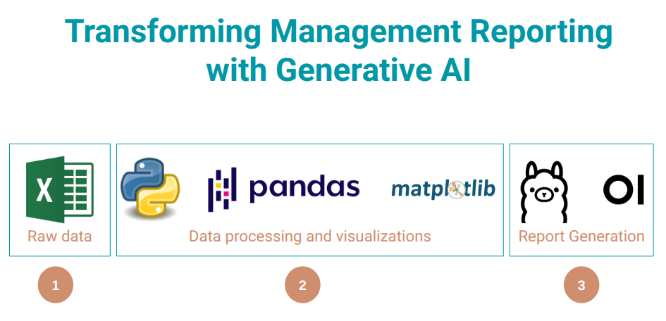

# Transforming Management Reporting with Generative AI (LLM)

## 1. Objective

This project is a proof-of-concept demonstrating how to combine data analysis techniques with Large Language Models (LLMs) to automatically generate management reports from raw financial data stored in Excel format. 

The goal is to streamline the report generation process, providing data-driven insights with AI-generated summaries and visualizations, a life changer for accounting and finance professionals.

## 2. Setup and Installation

### Prerequisites

*   **Python 3.8+**
*   **pip** (Python package manager)
*   **One of the following LLM options:**
    *   **Ollama** (for local LLM inference) - Free, requires installation
    *   **OpenAI API key** (for cloud LLM) - Paid, no installation needed
    *   **Anthropic API key** (for Claude) - Paid, no installation needed
    *   **Demo mode** - Free, no setup needed (uses pre-generated responses)

### Installation Steps

1.  **Clone the Repository:**

    ```bash
    git clone https://github.com/voidbydefault/LLM_Financial_Report_Generator.git
    cd LLM_Financial_Report_Generator
    ```

2.  **Create and Activate a Virtual Environment (Recommended):**

    ```bash
    python3 -m venv .venv
    source .venv/bin/activate  # On Linux/macOS
    .venv\Scripts\activate   # On Windows
    ```

3.  **Install Dependencies:**

    ```bash
    pip install -r requirements.txt
    ```

### 3. Configure LLM Provider

Choose one of the following options:

#### Option A: OpenAI (Cloud API - Recommended for Easy Setup)

1. **Get API Key**: Sign up at [OpenAI Platform](https://platform.openai.com/) and get your API key
2. **Set Environment Variable**:
   ```bash
   export OPENAI_API_KEY=sk-your-key-here
   export LLM_PROVIDER=openai
   ```

#### Option B: Anthropic Claude (Cloud API)

1. **Get API Key**: Sign up at [Anthropic Console](https://console.anthropic.com/) and get your API key
2. **Set Environment Variable**:
   ```bash
   export ANTHROPIC_API_KEY=sk-ant-your-key-here
   export LLM_PROVIDER=anthropic
   ```

#### Option C: Ollama (Local - Free, No API Costs)

1. **Download and install Ollama:** Follow the instructions on the [Ollama website](https://ollama.com/download) for your operating system.
2. **Verify Installation:** Run `ollama --version` in your terminal
3. **Start Ollama Server**:
   ```bash
   ollama serve
   ```
   Keep this terminal running while using the application.
4. **Set Environment Variable**:
   ```bash
   export LLM_PROVIDER=ollama
   ```

#### Option D: Demo Mode (No Setup Required)

For testing without any LLM setup:
```bash
export LLM_PROVIDER=demo
```

This uses pre-generated responses - perfect for quick testing and demos.

### 5. Running the Application

1.  **Configure LLM Provider** (choose one; or use a `.env` file with `LLM_PROVIDER` and API keys):
    
    **For OpenAI:**
    ```bash
    export OPENAI_API_KEY=sk-your-key-here
    export LLM_PROVIDER=openai
    ```
    
    **For Anthropic:**
    ```bash
    export ANTHROPIC_API_KEY=sk-ant-your-key-here
    export LLM_PROVIDER=anthropic
    ```
    
    **For Ollama (local):**
    ```bash
    ollama serve  # Start in one terminal, keep running
    ollama pull deepseek-r1:1.5b  # Pull a model
    export LLM_PROVIDER=ollama
    ```
    
    **For Demo Mode (no setup):**
    ```bash
    export LLM_PROVIDER=demo
    ```

2.  **Start the Web UI:**
    ```bash
    streamlit run streamlit_app.py
    ```

3.  **Use the Application:**
    - The app opens in your browser at `http://localhost:8501`
    - Select your LLM provider in the sidebar
    - Upload an Excel file or use the sample data (`1k_lines_sales_data.xlsx`)
    - Configure model settings in the sidebar
    - Click "Generate Report" to create your analysis

Output (analysis Excel, visualizations, markdown report, and Word document) is written to the `output` directory. 

## 6. Hardware Requirements

The hardware requirements depend heavily on the chosen LLM model (larger models require more GPU VRAM).

*   **Model options** (select in the Streamlit sidebar when using Ollama):
    *   `phi4:latest`: Best results; ~16 GB GPU RAM
    *   `gemma3:12b`: Good results; ~12 GB GPU RAM
    *   `deepseek-r1:1.5b`: Smallest; ~3 GB GPU RAM (may add `<THINKING>` in output)

    Use a smaller model if you have limited VRAM.

## 7. Why This Project?

I chose to build this project because:

1. **Real-World Problem**: Financial reporting is a time-consuming, repetitive task that many finance professionals face. Automating this process can save hours of manual work.

2. **LLM Innovation**: I wanted to explore how LLMs can be used for structured, factual analysis rather than just creative writing. This project demonstrates using LLMs as intelligent data analysts.

3. **Practical Application**: Combining data processing, visualization, and AI-generated insights creates a complete solution that could be immediately useful in financial services.

4. **Technical Challenge**: Integrating multiple components (data processing, LLM APIs, visualization, document generation) into a cohesive system demonstrates full-stack thinking.

5. **Financial Services Focus**: This directly addresses needs in the financial services industry, where automated reporting and insights are highly valued.

## 8. Design Decisions and Architecture

### Architecture Overview

The application follows a modular architecture with clear separation of concerns:

```
├── streamlit_app.py          # Web UI entry point (Streamlit)
├── analysis/
│   ├── data_processing.py    # Data loading and transformation
│   ├── llm_interaction.py    # LLM API communication
│   ├── visualizations.py    # Chart generation
│   └── report_generation.py  # Report orchestration
└── md_to_word.py            # Document conversion
```

### Key Design Decisions

1. **Modular Structure**: Each component (data processing, LLM interaction, visualization) is separated into its own module. This makes the code maintainable, testable, and allows for easy extension.

2. **Local LLM (Ollama)**: 
   - **Why**: Privacy and cost considerations. Financial data should not leave the organization.
   - **Trade-off**: Requires local GPU resources, but provides complete data privacy and no API costs.

3. **Streamlit for Web UI**:
   - **Why**: Rapid development, built-in widgets, and excellent for data applications. Single entry point keeps the submission focused.
   - **Trade-off**: Less customizable than React/Flask, but much faster to build and perfect for a proof-of-concept.

4. **Markdown as Intermediate Format**:
   - **Why**: Markdown is human-readable, version-controllable, and easily convertible to Word/PDF/HTML.
   - **Trade-off**: Requires conversion step, but provides maximum flexibility for output formats.

5. **Prompt Engineering Approach**:
   - **Why**: Structured prompts with explicit instructions ensure factual, data-driven analysis rather than creative writing.
   - **Trade-off**: More verbose prompts, but better control over LLM output quality.

6. **Excel as Input Format**:
   - **Why**: Excel is the de-facto standard in finance departments. Supporting it directly reduces friction.
   - **Trade-off**: Less flexible than CSV/JSON, but matches real-world usage patterns.

### Technology Choices

- **Pandas**: Industry standard for data manipulation
- **Matplotlib/Seaborn**: Proven visualization libraries
- **python-docx**: Reliable Word document generation
- **Streamlit**: Fastest path to a functional web UI
- **Ollama**: Best local LLM solution with easy API

## 9. Running in GitHub Codespace

To run this application in a GitHub Codespace:

### Option A: With Ollama (Full Functionality)

1. **Open in Codespace**: Click "Code" → "Codespaces" → "Create codespace"

2. **Install Ollama**:
   ```bash
   curl -fsSL https://ollama.com/install.sh | sh
   ```

3. **Start Ollama** (in background):
   ```bash
   ollama serve &
   ```

4. **Pull a Model** (this may take 2-5 minutes):
   ```bash
   ollama pull deepseek-r1:1.5b  # Smallest model - recommended for Codespaces
   ```

5. **Install Python Dependencies**:
   ```bash
   pip install -r requirements.txt
   ```

6. **Run Streamlit**:
   ```bash
   streamlit run streamlit_app.py --server.port 8501
   ```

7. **Access**: The app will be available via the Codespace's forwarded port URL.

**⚠️ Important Notes for Codespaces:**
- **No GPU**: Free Codespaces don't have GPU access - LLM inference will be slower (CPU-only)
- **Performance**: Expect 10-30 seconds per LLM call instead of 1-3 seconds
- **Memory**: Use smallest model (`deepseek-r1:1.5b`) - larger models may not fit
- **Timeout**: LLM requests have extended timeout (5 minutes) for CPU inference

### Option B: Demo Mode (Fast Testing, No Ollama Required)

For faster testing and evaluation without waiting for Ollama:

1. **Install Python Dependencies**:
   ```bash
   pip install -r requirements.txt
   ```

2. **Run Streamlit with Demo Mode**:
   ```bash
   DEMO_MODE=true streamlit run streamlit_app.py --server.port 8501
   ```

3. **Access**: The app will be available via the Codespace's forwarded port URL.

**Demo Mode Features:**
- ✅ Full app functionality (data processing, visualizations, report generation)
- ✅ Pre-generated LLM responses (no waiting for inference)
- ✅ Perfect for quick testing and evaluation
- ⚠️ Responses are generic templates (not data-specific)

**When to Use Demo Mode:**
- Quick testing/demo purposes
- Ollama installation issues
- Limited time/resources
- CI/CD pipelines

**When to Use Ollama:**
- Full functionality with real AI analysis
- Data-specific insights
- Production-like testing

## 10. Next Steps and Future Enhancements

If I were to continue developing this project, here are the planned improvements:

### Short-term (1-2 weeks)
1. **Enhanced Error Handling**: Better error messages and recovery mechanisms
2. **Progress Indicators**: More granular progress feedback during long-running operations
3. **Model Selection UI**: Allow users to see available models and pull new ones from the UI
4. **Report Templates**: Multiple report templates (executive summary, detailed analysis, etc.)

### Medium-term (1-2 months)
1. **Multi-file Support**: Process multiple Excel files and generate comparative reports
2. **Custom Prompts**: Allow users to customize LLM prompts for different analysis styles
3. **Export Formats**: Add PDF export, HTML reports, and PowerPoint presentations
4. **Scheduled Reports**: Add cron-like scheduling for automated report generation
5. **User Authentication**: Add basic auth for multi-user scenarios
6. **Database Integration**: Connect to databases (SQL, Snowflake, etc.) instead of just Excel

### Long-term (3-6 months)
1. **Multi-Agent System**: Use multiple specialized LLM agents (data analyst, writer, visualizer) working together
2. **Real-time Data**: Support streaming data sources and real-time report updates
3. **Advanced Analytics**: Add statistical analysis, forecasting, anomaly detection
4. **Collaboration Features**: Share reports, comments, annotations
5. **API Endpoints**: RESTful API for programmatic access
6. **Cloud Deployment**: Docker containerization and cloud deployment options
7. **Model Fine-tuning**: Fine-tune models on financial reporting data for better domain-specific outputs

### Technical Improvements
1. **Testing**: Comprehensive unit and integration tests
2. **Performance**: Caching, parallel processing, async LLM calls
3. **Monitoring**: Logging, metrics, error tracking
4. **Documentation**: API documentation, user guides, video tutorials
5. **CI/CD**: Automated testing and deployment pipelines